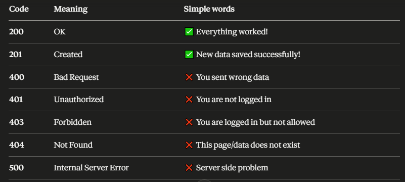

# API Notes

## What is API?

API is a middleman that lets two apps/systems communicate and share data with each other

# 3 Parts:

- Client :the one who always sends request(whoevr is asking)
- API:the middleman that carries/process the request
- Server:the one who replies to the requset of client with data(whoever is answering)

# how it works

CLIENT → request → API → SERVER
CLIENT ← response ← API ← SERVER

# Important Points:

- server can also become a client when it sends a new requset to the other system
- Replying to a request does NOT make you a client only starting a NEW request makes you a client
- Password is never seen by API or Server because:
  - Password is encrypted before sending
  - Server saves hashed version not real password

# Real Life Examples:

- Facebook login → your app (client) → FB API → FB Server
- Foodpanda → asks Google Maps API for routes
- Weather app → asks government weather server for data

## Encryption:

- scrambling(mixing data in to non-readable for so that no one can understand that) data so only right person can unscrumble and raed it
- It can be reversed back to original with a key

## Hashing:

- Converting data into a fixed code that can NEVER be converted back.
- It is one way — no reverse, no key
- Server never reverses the hashinstead it compares hashes
  - You type password →"mypassword123"
  - Server hashes it → "x7#kL9@mQ2$"
  - Compares with saved→"x7#kL9@mQ2$" MATCH!

## HTTP request methods

### What is HTTP?

- HTTP stands for HyperText transfer protocol
- a set of rules that decide how the data over the internet will be recieved and sent (or we can say share) between the client and server
- the full picture
  - Client-> HTTP request-> server
  - client<- HTTP response<-server
- HTTP is designed to enable communication between server and client

# HTTP request methods

- GET : Asking server to give us some data (Read/fetch)
- POST : sending new data to the server(send/create new data)
- PUT : sending data to replace entire data on the server(update whole data)
- PATCH :sending data to the server to replace only one thing or a part of entire data on the server(update a part of data)
- DELETE:Telling server to remove something (delete data)

# 1. GET Request

- The request we use to read/request/fetch data from server ,it can only read(can only fetch and diplay data) this request cant amke changes to the data inside database
- Note that the query string (name/value pairs) is sent in the URL of a GET request:
  /test/demo_form.php?name1=value1&name2=value2
- GET requests can be cached
  Caching means saving the response of GET request on your device so that instaed of asking server again data just loads from our device instantly
- GET requests have length restrictions

## How it works:

- client -->send me the facebook feed-->server
- client<--sends back all the posts<--server

## Real life examples:

- Opening Facebook → GET(fetch all posts)
- Searching something on Google->GET(fetch results)

GET requests are very useful in APIs as they allow a client to quickly and easily obtain information from a server without requiring any additional modifications like posting data or changing configuration settings.

## Important points about GET:

- it cannot make changes to the data
- used for reading and fetching data
- its not safe for secret data(like passwords)

### why passwords are not safe with GET request

## GET puts data in the URL:

- when we send GET request our data goes in to the URL
- like www.facebook.com/login?password=mypassword123
- Anyone can see our password

# 2.POST METHOD(request)

- POST is used to send new data to the server/database to save it or create something new
- The data sent to the server with POST is stored in the request body of the HTTP request:

  POST /test/demo_form.php HTTP/1.1
  Host: w3schools.com

  name1=value1&name2=value2

- POST requests are never cached
- POST requests have no restrictions on data length
- alwys send payload data in json paramter when sending post request else server will reject it

## Real life examples:

- Signing up on Facebook → POST (sending your info to save)
- Uploading a photo on Instagram → POST (sending photo to save)

## Important points about POST:

- it can make changes to the data(craete new data)
- used for creating/storing and sending new data
- sends secrrets safely(so its safe for passwords)

#### Simple rule:

whenever you are submitting or creating something new that is post request

##### NOTE:

POST make changes to the data means it make changes in the data stored in database new data gets added and saved to the database that was not there before

### EXAMPLE

before we signup on face book database will have no record of us

- data inside database before post request
  [sara,ali,ahmed]
- data after our POST request
  [sara,ali,ahmed,me]

this is how changes were made to the database

### why passwords are not safe with GET request

## POST hides data inside the request:

- when we make POST request our data goes hidden inside request body,not in URL
- URL shows: www.facebook.com/login
  Password: hidden inside request ✅
- no one can see our passwords

## SUmmary of both:

GET is like talking loudly in public , POST is like whispering in private

## So the flow pf both is:

sending data 1st time-> POST REQuest-> sends password -->server sends token
asking for data->GET request-->send token/not password again-->servers send you data

# 3.PUT Method

PUT request we use to replace/update entire existing data in the server with the new data

## How it works:

- CLIENT → sends complete new data → SERVER
- CLIENT ← confirms updated ← SERVER

## Real life example:

### Updating your Facebook profile:

- Old profile:
  Name: Ali
  Age: 20
- After PUT request:
  Name: Ali Khan
  Age: 21

- Everything got replaced with new data
- if we send only name in the PUT requset server will delet evrything else and will save only the name

# PATCH Method

PATCH is used to replace /update only one or few fields of the data not entore data

## real life example

Changing only my profile picture on Facebook:

- Old profile:
  Name: Ali
  Age: 20
  Picture: old pic

we send PATCH with only new picture

- After PATCH:
  Name: Ali (unchanged)
  Age: 20 (unchanged)
  Picture: new pic (only this changed)

# 5.DELETE Method

- delete is used to dlt/remove entire existing data from the server permanently
- it can change the data (it removes the data from the server)
- its not reversible (data will be removed permanently)

## Real life examples:

- deleting my facebook a post

## how it looks

- Database before DELETE:
  [ Ali, Sara, Ahmed, YOU ]

I send DELETE request

- Database after DELETE:
  [ Ali, Sara, Ahmed ]

### NOTE: Almost all APIs send and receive data in JSON format only

# Status codes (200, 404, 401, 500)

### Definetion

status codes wo 3 digit numbers hoty hain jo server humy hamari request k baad jo response bhjta h us response k sath display krta h humy yeh btany k liy k hamri request sucessfull thi ya failed
like

- 200 ka matlab h sucess
- 404 page not found
- 500 means server has a problem

### RULE

starts with ->2XX -> Sucess
starts with ->4XX-> Our mistake(client)
starts with->5XX-> server mistake

### MOST COMMON CODES

# why we use API keys in APIs URLs??

- the secret code we send in the header or in URL with our requset to prove that we are authorized users of that API
- to track who or wich developer is making request
- to track uasge(to track how many times API calls were made)
- to limit usage,charge money if needed

# Request and Response structure

## Request Structure:

- Everything we send to the server has 3 parts
  Part what it is
  URL adress of the server(to whom we are requesting)
  Headers extra info like content type(e.g,JSON),token,date
  Body actual data we are sending to the server(in PUT,POST,PATCH)

## Response structure:

- everything server sends back also has 3 parts
  Status code 200,400,500 etc
  Headers info about the response (server bhi humy content type btata h)
  Body actual data server sent back(JSON)

# difference between synchronous and aynchronous

### Synchronous:

tasks run one by one like the 2nd task wait until the frst one finishes

### Asynchronous:

all the tasks run together-second task does not wait for another task to finish

# requests library

- it works synchronously
- its a third party HTTP request library in python
- we can use it to send our HTTP requests like GET,PUT,DELETE,POST,PATCH to APIs and get response back without writing complex code
- jab hum server sy data recive krty hain wo JSON format main hota h
- ## we can use methods of response object to process data we get from server
  - response object wo hoti hai jo requests.get() return krti hai after calling API
  - it contains all the data, status code, headers and other information that server sent back
  - respose.text : it will return orignal json as it will come from the server,returns data as string.
    raw data but in string and its human readable
  - resposne.content: it also return raw data but in bytes and its not human readable
  - response.json():it will convert json data into python dict autmatiaclly which it recived from server
  - response.status_code:return status code
  - response.url:returns URL that was called
  - response.headers:it returns extra information(details) that server sends along with response like date,content-type,APi key security settings and rate limits
  - without key in header server hamri request ko status code 401 k sath reject kr dy ga (unauthorized) ## Headers contain
    - server date,security setting,content type ,rate limit,cache info
    - client API key, content-type, token, authorization

## built-in functions by request library:

- we need rootURl and end point
- /url/posts(endpoint)
- endpoint tells the server what resource we want to acess or what action we want to perform
- rqeuests.get(URL)
- requests.post(URL,json=payload)
- requets.put('base_URL/endpoint/id,json=payload) id to tell server which record we need to replace
- requests.patch('base_URL/endpoint/id,json=payload)
- request.delete('base_URL/endpoint/id') #o payload data needed

# difference between JSON and json

- JSON is the data format we use to store data and transfer it (between client and server)across the systems
- json is a python library we use to handle JSON(read and convert JSON into our code/python)

# what is payload data ??

- the actaul data transmitted between the server and client
- it dont include metadata like headers,status code,URL parameters,cookies
- it only includes meaningful info that we need to take an action or return results
- like email,name,image,age etc
- server and client both can send payload data to each other (its oneway)

# difference between path paramter & query paramter

- ID or value we put inside the URL path to target specific resource
  like /post/5 post number 5 is called path paramter (usually required)
- the extra filters we put at the end of URl with ? to tell server what sepcific data we want is called query parametr (usually optional)
  like /posts?userId=1 we want posts of user whose userId is 1
- path parametr is targeting the singgle record by ID
- query paarmetr is searching and applying filtering on multiple records
- if we need to use multiple query parametrs we can use ? before frst query parametr and we can use & for the other query paramters in a single URL

# extracting data from JSON response

Extracting data from JSON response means picking out only the specific values we need from the JSON response like getting only `temperature` and `city` from a big weather JSON response and ignoring everything else

# params in a URL

appid={API_key}
q={city_name}
units=metric #returns celcius
can read more in documentation

### NOTE: we can use data.keys() to get the keys and API's json response contain

# diffrence between response.status_code and cod

- response.status_code comes from the HTTP response headers — it is the status code from the server itself.
- cod is inside the JSON response body — it is the status code that OpenWeatherMap sends as part of their own data.
  Both can show 200 or 404 but they are in different places!You said: both are coming from server
