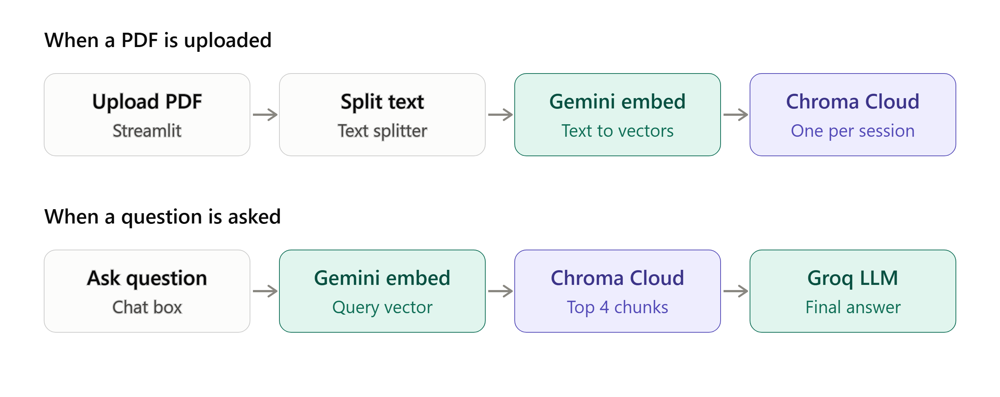
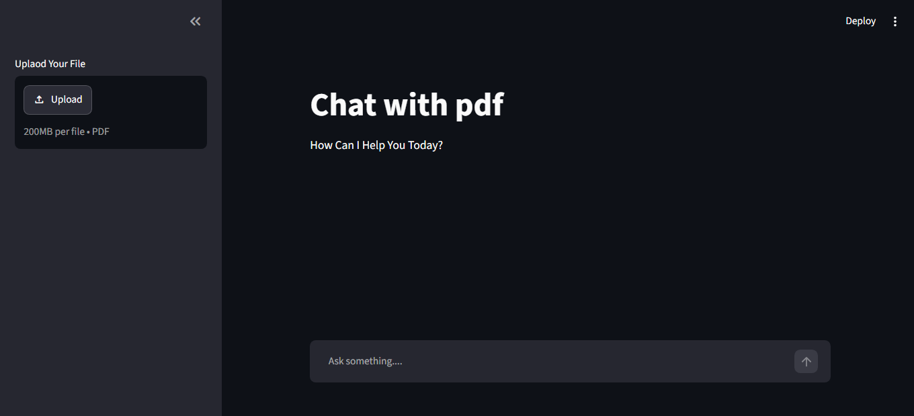
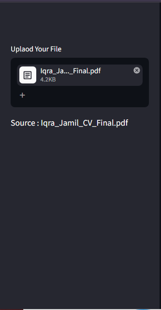
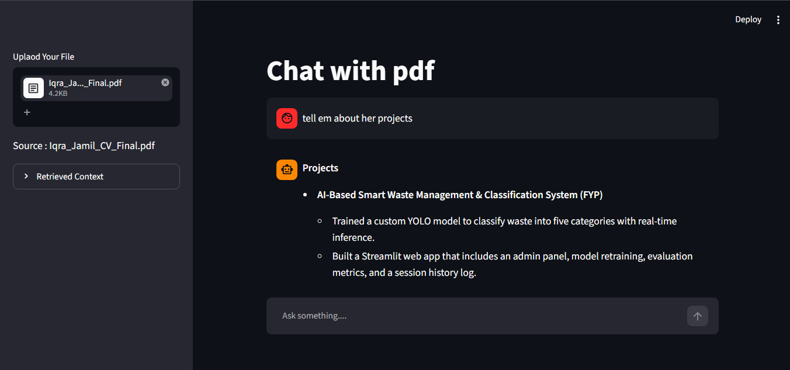

- if user_query is not None:
 handle only NOne and it nver handle "",[],0,False,{}
- if user_query:
handle not only NOne but also "",[],0,False,{}

- few Streamlit widgets themselves preserve 
like file_uploader preserve documnt
### we will see later
### chaining
### where session state variable store data
- st.session_state stores data in Streamlit's server-side memory for that user's active session.
## problem i faced :
- The problem I faced was that Streamlit reruns the script every time the user sends a query. I thought that because client and collection were recreated on every rerun, they would become empty since the PDF processing code does not run again.

- However, the newly created Chroma client was still able to access the previously stored collection data. This is because chromadb.Client() uses in-memory storage, and the data remains in the running Python process. Recreating the client does not necessarily create a completely new empty database. The new client can access the existing in-memory(app's RAM) Chroma data while the app process is still running.
# reason to keep one client instaed of recraeting client on evry rerun
- if your Streamlit app is running on your PC, the Chroma data is stored temporarily in your PC's RAM.
- even new client is pointing to the old db data wihc is in-memry db right?? and yu are saying a differnt version of chroma may craete new store for a new client right??? and pointing of new client on 2nd run to the new database will have no data at all bcz  so may be infuture i use any otehr chroma version and that version may not behva e as my curent chroma version 
- The reason to keep one client is mainly simplicity and avoiding unnecessary client creation
# what is @st.cache_resource
- @st.cache_resource tells Streamlit to run the function once, save what it returns, and hand back that same saved object on every rerun instead of running the function again.
- @st.cache_resource is a Streamlit decorator that tells Streamlit to create a resource once and reuse the same object across reruns.
- For example, our Chroma client is created once, then the same client is reused instead of creating a new one on every rerun.

### what is User's streamlit session 
means the connection between a bowser tab and the UI of the app we are displaying on that browser
### how we can prevent client from recraeting on evry run
- by creating a function using @st.cache_resource (appropriate choice)
- or by using sessiion state variable 

# where the data of both stored
### st.session_state
- data stored for a specific streamlit user's session
- it store the data in streamlit's server memory(streamlit's RAM)

### @st.cache_resource 
- we can share/reuse it across different sessions
- it store data on application level cahche
# when the data will be cleared from both 
### st.session_state
- Cleared when that user's session ends or is reset.
### @st.cache_resource 
- Cleared when the cache is cleared, the app process restarts, or the cached function/code changes in a way that invalidates the cache.
# whats themain differnce beween both
### st.session_state
- session-specific data.
### @st.cache_resource 
- reusable application-level resources.
# for what they mainly designed for
### st.session_state
- Chat history
- User selections
- Uploaded-file state
- UI state
### @st.cache_resource 
- is shared across users and sessions by default.(so we cant use it to persist chat history)
- Database clients
- API clients
- ML models
- Chroma clients
- Other expensive resources you want to create once and reuse.

### chromadb.Client() and chromadb.PersistentClient
chromadb.Client() → keeps Chroma data in memory and the data can disappear when the app process restarts.
chromadb.PersistentClient(path="./your_directory") → persistent local storage

## why then we also didnt use @st.cache_resource
- The problem is @st.cache_resource makes the same chromadb.Client() shared across users.

# embed_and_store

- return True at the end of try means "embedding worked", and return False in except means "embedding failed".
- store True and false in a variable
 
- st.session_state['processes_file'] = uploaded_file.name runs every time, even when embedding isnide embed_and_store failed.st.session_state
- neechy aien gy processes_file != uploaded_file.name
yeh line file name ko update kr dy ge yani yeh line btay ge k file process ho chuki h(embeding ho chuki h)
- so now when user will send a query script rerun ho ge and chat start ho jay ge embeding to hoes nai but empty colection LLM k pass jaa rai h 
- so now LLM will give no info on evry query
- to handle this we need to track if emebding fail hoe h ya sucessfull
- so now we will upadte file name only when the function is returning tRue else that line should be skipped 
- ab jab name he upadte nai hoa ho ga or user query bhjy ga embeding wala function dubara run ho ga bcz processes_file != uploaded_file.name yeh condition ab true h 

# Architecture Diagram

# App  Screenshots

